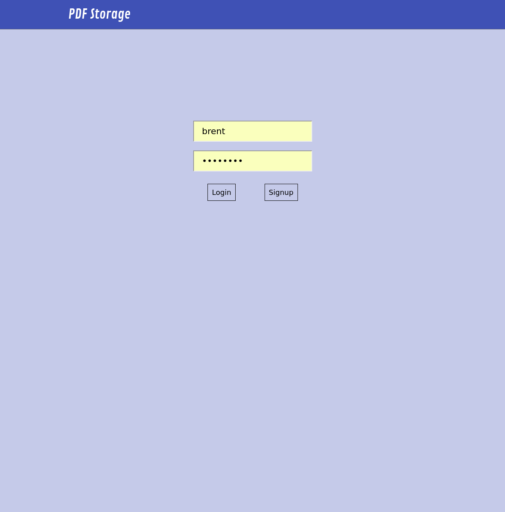
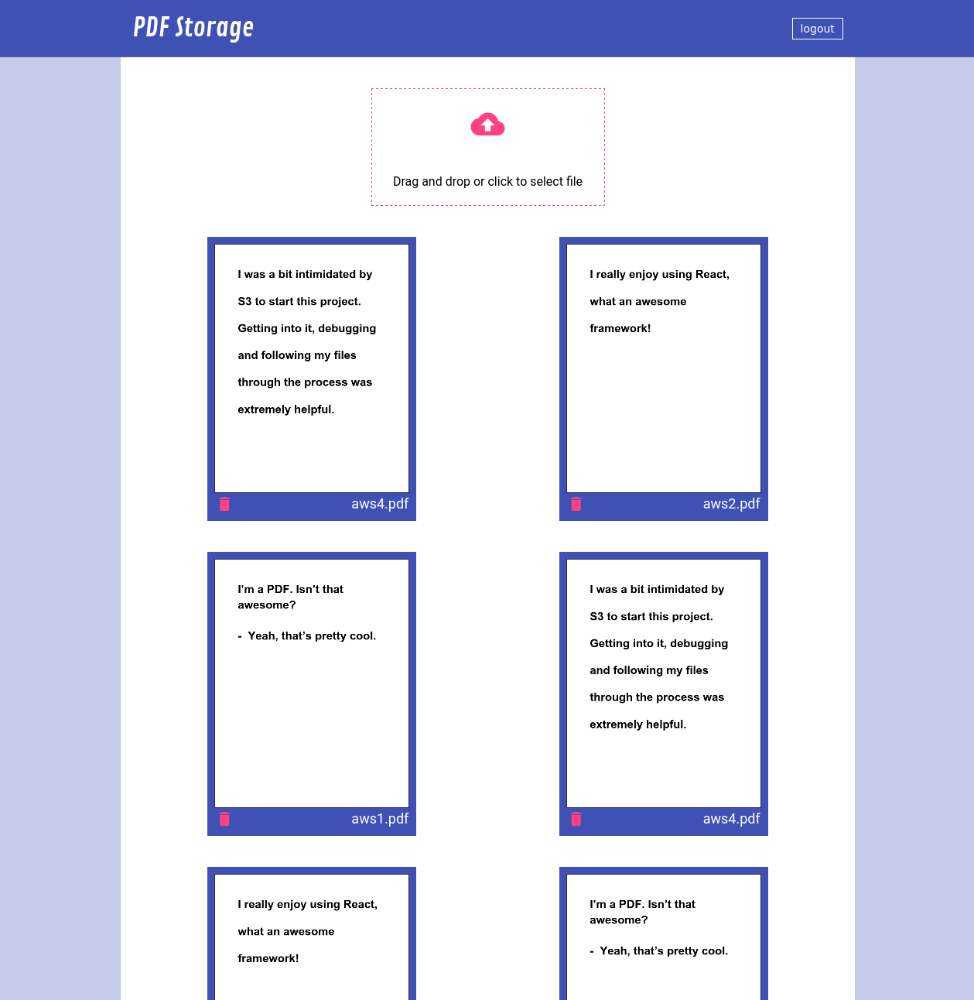

# PDF Storage 


[Live Link](http://brents-pdfs.herokuapp.com)

Full Stack Single Page app where a user can sign in and upload and download pdf
files. I used this app as an opportunity to learn about AWS S3 as a means for
storing files, something I had no experience with but wanted to get an
understanding of. 






## Technologies 

- Ruby on Rails 
- JavaScript 
- React.js
- Redux 
- AWS S3
- PostgreSQL Database 


## Description 


### Auth
I implemented my own auth, utilzing BCrypt to generate hashed password digests from user's passwords and
SecureRandom to generate session tokens.

```ruby
class User < ApplicationRecord
  attr_reader :password

  validates :username, :password_digest, :session_token, presence: true
  validates :username, uniqueness: true
  validates :password, length: {minimum: 6}, allow_nil: true

  after_initialize :ensure_session_token
  before_validation :ensure_session_token_uniqueness

  has_many :pdfs,
    primary_key: :id,
    foreign_key: :user_id


  def password=(password)
    self.password_digest = BCrypt::Password.create(password) 
    @password = password
  end

  def self.find_by_credentials(username, password)
    user = User.find_by(username: username)
    return nil unless user
    user.password_is?(password) ? user : nil
  end

  def password_is?(password)
    BCrypt::Password.new(self.password_digest).is_password?(password)
  end

  def reset_session_token!
    self.session_token = new_session_token
    ensure_session_token_uniqueness
    self.save
    self.session_token
  end

  private

  def ensure_session_token
    self.session_token ||= new_session_token
  end

  def new_session_token
    SecureRandom.base64
  end

  def ensure_session_token_uniqueness
    while User.find_by(session_token: self.session_token)
      self.session_token = new_session_token
    end
  end
end

```


### AWS S3

I have been interested in getting some experience using AWS and thought this
would be a good idea to learn about it's S3 storage solution and implement it as
a means to store the user uploaded PDF's. I would dispatch the file to a Upload
Controller in rails, which would take the file and create a presigned url and
return that along with a public url. Upon receiving that response, I would make
2 separate disptaches, one with the presigned URL to upload to S3, and one with
the public URL to store it in my PDF table in PostgreSQL in order to keep track
of a users PDF's.


```ruby
class Upload < ApplicationRecord

  def self.presign(prefix, filename, limit: limit)
    extname = File.extname(filename)
    filename = "#{SecureRandom.uuid}#{extname}"
    upload_key = Pathname.new(prefix).join(filename).to_s

    creds = Aws::Credentials.new(ENV['AWS_ACCESS_KEY_ID'], ENV['AWS_SECRET_ACCESS_KEY'])
    s3 = Aws::S3::Resource.new(region: 'us-west-1', credentials: creds)
    obj = s3.bucket('brent-pdfs').object(upload_key)

    params = {acl: 'public-read'}
    params[:content_length] = limit if limit
    
    {
      presigned_url: obj.presigned_url(:put, params),
      public_url: obj.public_url
    }

  end
end
```

### Display

I utilized React.js to create compoenents which make up the UI. I utilized Redux
to manage my client side state, re rendering the DOM as that state changed, such
as adding or removing PDFs. I wanted to render a preview of the user's PDF's.
Unfortunately I was unable to find an appropriate way to embed a PDF in
HTML that looked, good in the process. I considered making a converted version
of the pdf on the rails backend and storing it in S3 as well, but was hoping to
avoid storing uneccesary data if possible. I came across a react component that
would convert a PDF to a canvas element, allowing it to be presented as an image
and avoid storing extra files in S3.

```javascript
const PdfIndex = ({pdfs, deletePdf}) => {

  const mapPdfs = () => {
    let lis = [];
    if (pdfs && Object.keys(pdfs).length) {
      for (let pdf in pdfs) {
        let currPdf = pdfs[pdf];
        lis.push(
          <li key={pdf} className='pdf-li'>
           
            <a href={currPdf.url} target='_blank'>
              <PDFViewer file={currPdf.url} />
            </a>
              <div className='title-div'>
                <i className='material-icons trash-icon' onClick={() => deletePdf(pdf)}>delete</i>
                <h4>{currPdf.title}</h4>
              </div>
          </li>
        )

      }
    }
    return lis;
  }

  return (
    <div className='pdfs-container'>
      <ul className='pdfs-ul'>
        {mapPdfs()}
      </ul>
    </div>
  )
}
```


## Future Direction 

- Add a form for each pdf, where you can change the title and add a description
- Add a sharing button to each pdf, where you can click on it to email it to
  someone
- Polish up the design and styling
- Add rspec tests on the rails controllers and models  
